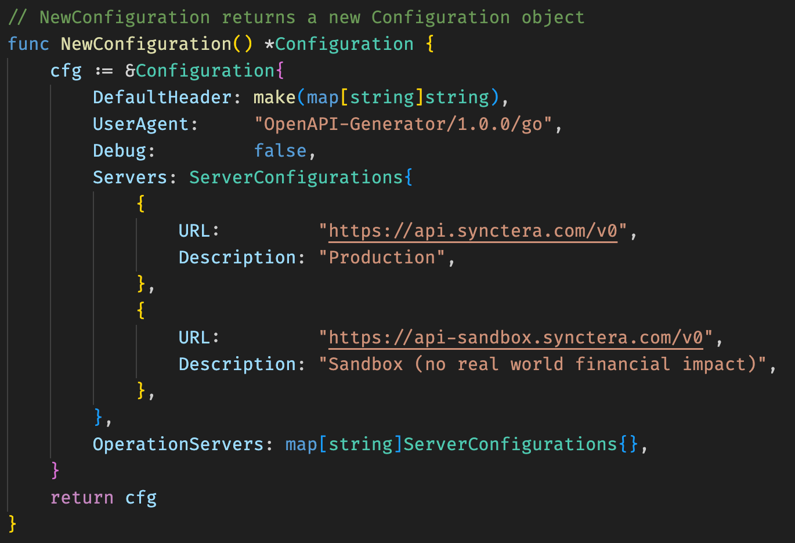

# Synctera Client Library

To generate a new version of the client follow these steps:

1. Install openapi-generator

```
ex: macOS
brew install openapi-generator
```

2. Install goimports

```
go install golang.org/x/tools/cmd/goimports@latest
```

3. Download the latest API spec from `https://dev.synctera.com/reference/openapi-spec` and name it `synctera_openapi.json`
4. Delete the `client` folder
5. Run the command:

```
openapi-generator generate -i synctera_openapi.json -g go -o ./client --additional-properties=useOneOfDiscriminatorLookup=true,enumClassPrefix=true,packageName=synctera_client,disallowAdditionalPropertiesIfNotPresent=false --git-user-id paybotic --git-repo-id synctera_client_library/client --global-property=apiTests=false
```

6. Switch to ./client directory
7. Run `goimports -w .`
8. Run `go mod tidy`
9. Go to file `./configuration.go` and make sure in the `NewConfiguration` function the `Servers` properties has production env first and sandbox env second
   
10. Run `go build ./`
11. Once go build runs without any errors push the changes
